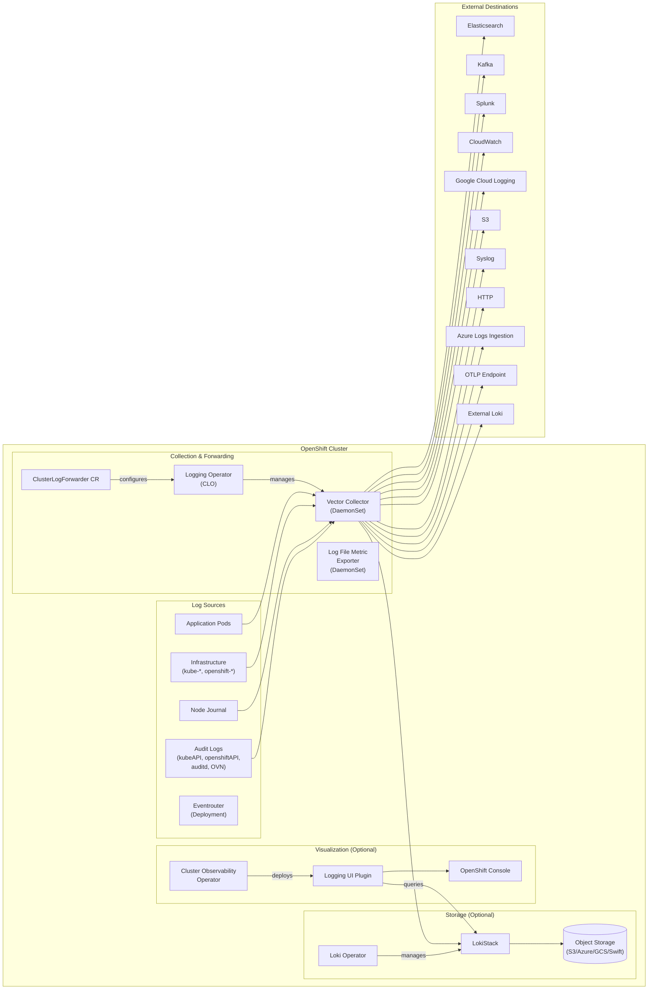
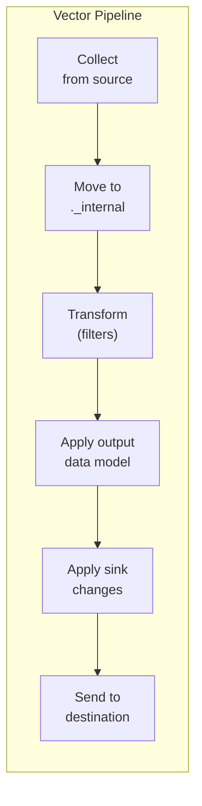

# Architecture

Red Hat OpenShift Logging 6.x provides cluster-level log collection, forwarding, storage, and visualization for OpenShift Container Platform.

## System Components

## Data Flow

Logs flow through the Vector collector in stages:

1. **Collect** — reads logs from container log files (CRI-O format), node journal, or audit log files
2. **Internal routing** — moves events into internal processing
3. **Transform** — applies configured filters (drop, prune, parse, detect multiline, kube API audit, openshift labels)
4. **Data model** — applies the output-specific data model (ViaQ or OpenTelemetry)
5. **Sink** — applies output-specific formatting and batching
6. **Send** — delivers to the configured destination with retry and delivery guarantees

## Operator Responsibilities

### Red Hat OpenShift Logging Operator (CLO)

Watches the `ClusterLogForwarder` CR and reconciles:
- Vector collector DaemonSet (or Deployment for receiver-only configs)
- Vector configuration (generated from the CLF spec, not templated)
- RBAC (Roles, RoleBindings for log access authorization)
- NetworkPolicies
- ServiceMonitors for metrics
- Periodic permission recheck (every 5 minutes)

### Loki Operator

Watches `LokiStack`, `AlertingRule`, `RecordingRule`, and `RulerConfig` CRs and reconciles:
- All Loki components (distributor, ingester, querier, query frontend, compactor, index gateway, ruler, gateway)
- OpenShift-specific gateway with OPA-based multitenancy
- Object storage configuration
- Zone-aware replication
- Retention policies

### Cluster Observability Operator (COO)

Watches `UIPlugin` CRs and deploys:
- Logging Console Plugin as a dynamic OpenShift Console extension
- Connects to LokiStack for log queries

## Repository Structure

| Repository | What it owns |
|---|---|
| `cluster-logging-operator/` | ClusterLogForwarder API, Vector config generation, collector lifecycle |
| `loki/operator/` | LokiStack API, Loki deployment management, OpenShift auth integration |
| `vector/` | Upstream Vector collector (sources, transforms, sinks) |
| `eventrouter/` | Kubernetes event log exporter (converts events to structured log entries) |
| `log-file-metric-exporter/` | Prometheus metrics for container log file sizes on each node |
| `logging-view-plugin/` | OpenShift Console logging plugin (React frontend + Go backend) |
| `openshift-docs/` | Product documentation (authoritative for supported features) |

## Key Architectural Decisions

**Vector is the sole collector.** Fluentd was deprecated in favor of Vector for better performance and a simpler configuration model. The operator generates Vector configuration from Go structs (not templates) for type safety.

**Multitenancy is enforced at multiple levels.** The ClusterLogForwarder's service account RBAC determines which log types can be collected. LokiStack's gateway enforces tenant isolation (application/infrastructure/audit) using OPA policies integrated with OpenShift authentication.

**The OTEL data model is Technology Preview.** While LokiStack can ingest OTLP natively, the CLO's OpenTelemetry data model transformation and the OTLP output type are still TP. The default data model remains ViaQ.

**Documentation defines supportability.** Features in source code but absent from documentation are unsupported. The `openshift-docs` repo on the `standalone-logging-docs-main` branch is the authoritative source for what is GA vs Technology Preview.
